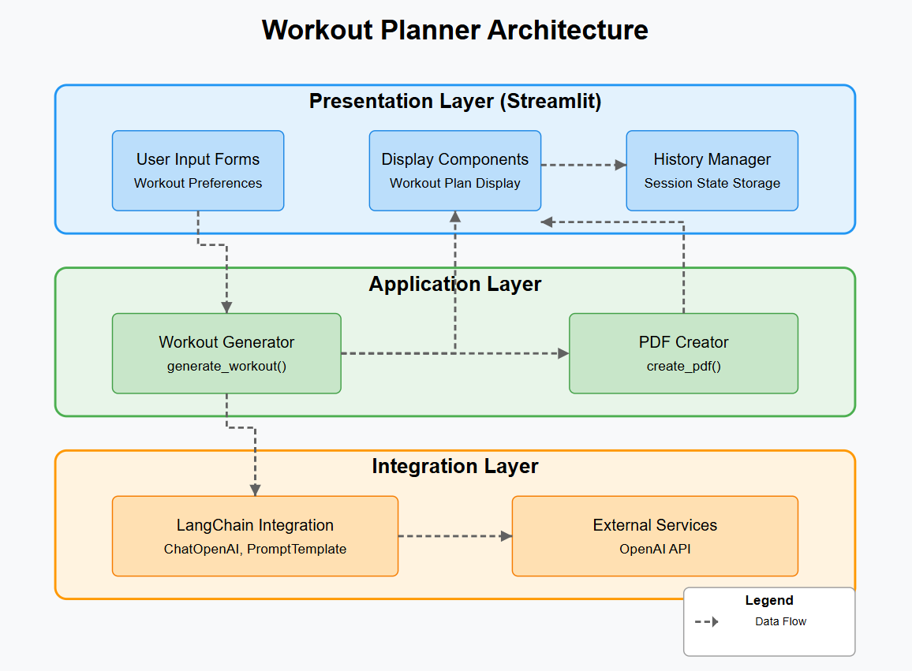

# Problem Statement

Many people struggle to stay fit because they don’t have a personal trainer or a workout plan that fits their needs. Hiring a coach is expensive, and most online workout plans are too general.

This project, AI-Powered Fitness Coach, solves this problem by using AI (OpenAI), Python, Streamlit, and LangChain to:
- Create personalized workout plans based on user details (age, weight, fitness level, goals).
- Provide AI-powered coaching with real-time advice and fitness tips.
- Let users chat with an AI fitness coach to ask workout-related questions.
- Offer a simple, interactive web app (built with Streamlit) for easy access.

With this project, anyone can get a custom fitness plan and coaching for free using AI! 



### Installation Steps

**1.  Clone the project**
```bash
git clone https://github.com/
cd ai-fitness-coach
```

**2. Create a virtual environment**
```bash
conda create -p env python=3.10 -y
```

**3. Install dependencies**
```bash
pip install -r requirements.txt
```

**4. Run application**
```bash
streamlit run app.py
```

## Data Flow

1. User inputs workout preferences through the Streamlit UI
2. Application processes these inputs using the workout generator
3. Workout generator creates a prompt and sends it to LangChain
4. LangChain communicates with OpenAI API to generate a personalized workout plan
5. Generated plan is returned and displayed to the user
6. Optional PDF creation for downloading the workout plan
6. Plan is stored in session history for future reference

### How to Add to Resume (Bullet Points)
- Developed an AI-powered fitness coaching app using OpenAI, Python, Streamlit, and LangChain for personalized workout recommendations.
- Built a chatbot that provides real-time fitness coaching and tailored exercise plans.
- Integrated AI-driven conversation features using LangChain to enhance user experience.
- Deployed an interactive web app with Streamlit, allowing users to access fitness guidance easily.

## For Mentorship Connect me here [Click here](https://topmate.io/shivan_kumar1)
